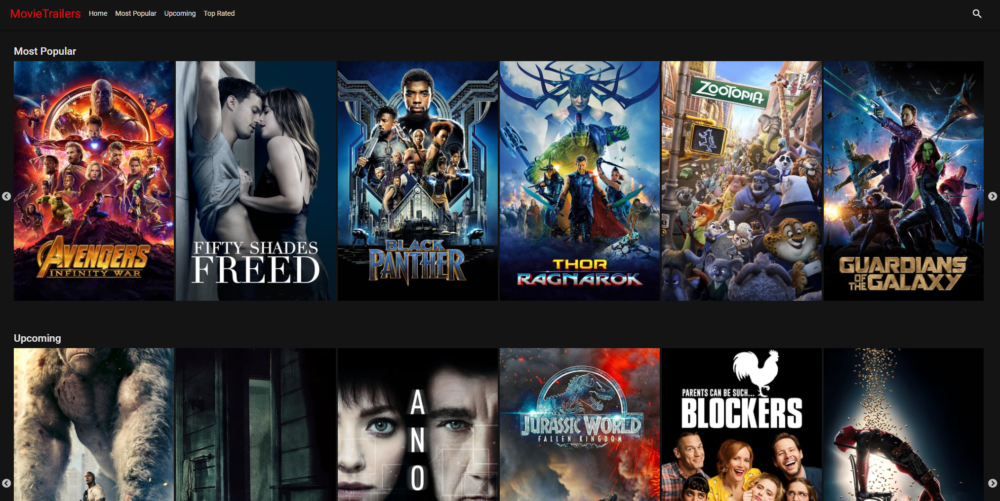
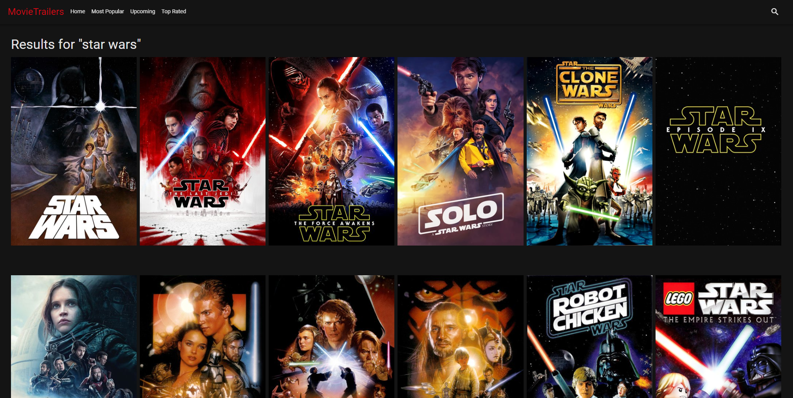
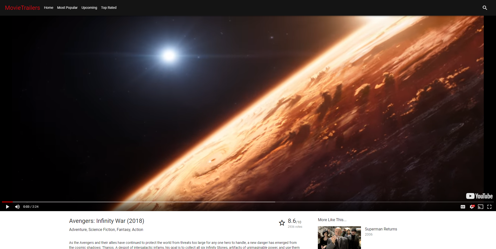
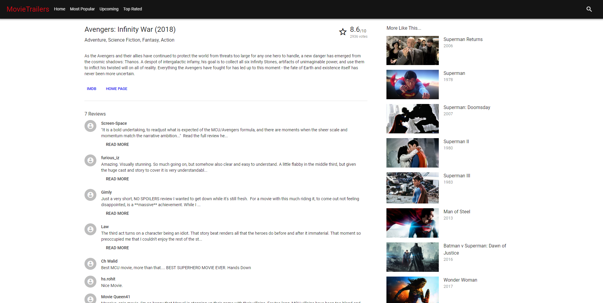

# MovieTrailers

[MovieTrailers](https://agile-river-40150.herokuapp.com/)

<table>
  <tr>
    <td>
      MovieTrailers is a Netflix/YouTube clone using The Movie Database API to display movie trailers and related information.
    </td>
  </tr>
</table>

## Features

### Sliders

The home page features a Netflix style design with multiple sliders, using React Slick to allow users to easily browse through top movies from multiple categories on one page.

### Infinite Scrolling

Some pages, including the search page allow for infinite scrolling for fast and easy browsing. The content is a responsive grid of movie posters.

### Movie Page

The movie page features a YouTube style design with a full-width video at the top and the title, description, genres and ratings below.

### Reviews and Similar Movies

Movie pages also have a list of collapsed reviews and similar movies on the side.

### Built with

* [React](https://reactjs.org/) - JavsScript library for building user interfaces.
* [Redux](https://redux.js.org/) - Predictable state container for JavaScript apps.
* [Material-UI](https://material-ui-next.com/) - React components that implement Google's Material Design.
* [The Movie Database API](https://www.themoviedb.org/documentation/api/) - API for retreiving GitHub profile information.

### To-do

* Allow users to be redirected and sign in to The Movie Database.
* Add TV Shows.
* Allow users to rate movies.
* Allow users to comment on movies.
* Add a dashboard for signed in users, showing their movie ratings.
